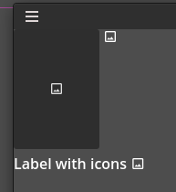
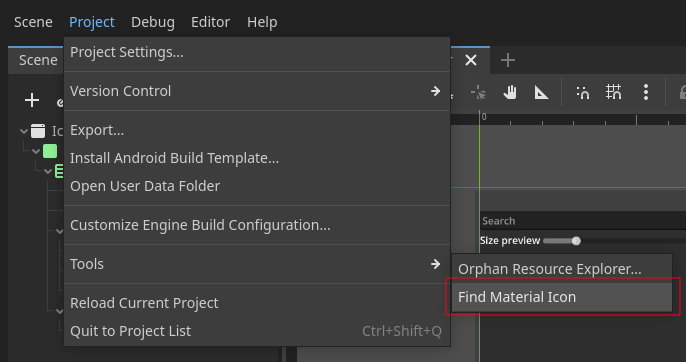
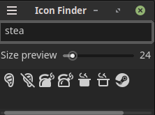
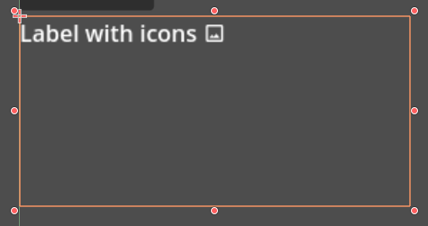

![github-top-lang][lang] ![lic] ![lic-font]

# MaterialIcons for Godot

[*Templarian's Material-Design-Icons*](https://github.com/templarian/MaterialDesign) 
is a collection of icons for the [Material Design](https://material.io/) specification.



Now compatible with both Godot 3.4+ (version 1.x) and 4.0+ (version 2.x).

This addon provides the following nodes to use the icons in Godot:
- **MaterialIcon**: A node that displays an icon from the Material Design Icons collection.
- **MaterialButton**: A node that displays an icon from the Material Design Icons collection as a button (without label).

Version 2.0 is rewritten to give you access to **MaterialIconsDB** singleton for easier use of icons anywhere in your project.

It's also adds **IconsFinder** to the Godot's **Tools** menu.



So you can find the icons easily.



## Using it with RichTextLabel
From version 2.0 you can use the icons in RichTextLabel.



```gdscript
@tool
extends RichTextLabel

@export_multiline
var text_with_icons : String:
	set(value):
		text_with_icons = value
		bbcode_enabled = true
		text = MaterialIconsDB.parse_icons(value)

	get: return text_with_icons

func _ready():
	bbcode_enabled = true
	text = MaterialIconsDB.parse_icons(text_with_icons)
```

## Exporting
For emojis to work in exported projects, you need add `*.json` files to include files settings:

