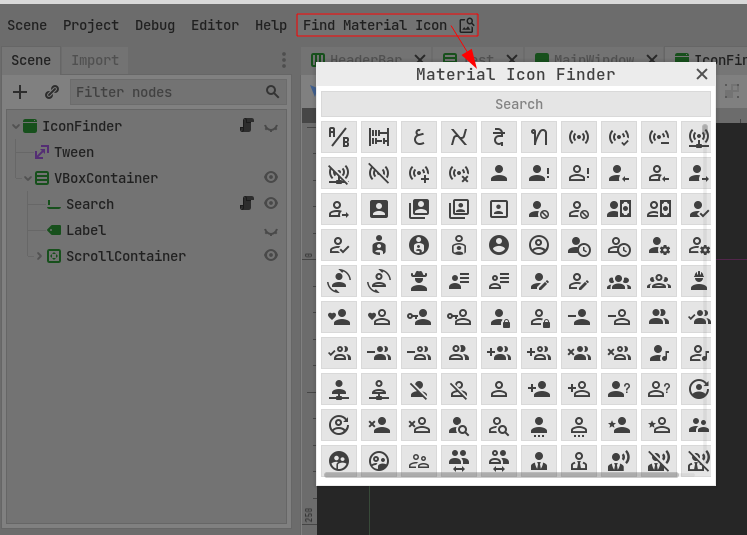

![github-top-lang][lang] ![lic] ![lic-font]

# MaterialIcons for Godot

[*Templarian's Material-Design-Icons*](https://github.com/templarian/MaterialDesign) is a collection of icons for the [Material Design](https://material.io/) specification.

This addon provides the following nodes to use the icons in Godot:
- **MaterialIcon**: A node that displays an icon from the Material Design Icons collection.
- **MaterialButton**: A node that displays an icon from the Material Design Icons collection as a button (without label).

It's also adds **IconsFinder** to the Godot editor's toolbar.
So you can find the icons easily.

[lic]: https://img.shields.io/github/license/Jeremi360/QuestManager?style=flat-square&label=📃%20License&
[lang]: https://img.shields.io/github/languages/top/Jeremi360/QuestManager?style=flat-square
[lic-font]:https://img.shields.io/static/v1.svg?label=📜%20Font-License&message=Pictogrammers-Free-License&color=informational&style=flat-square
